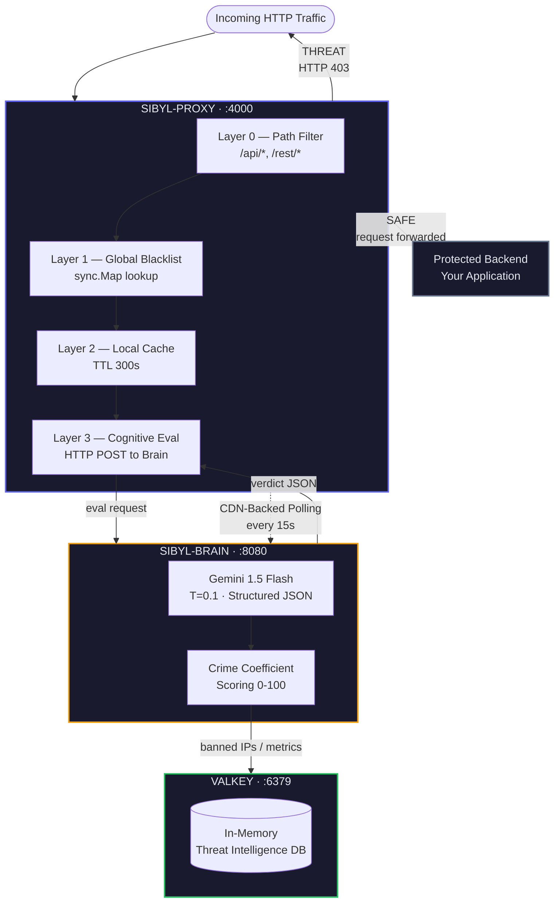

<div align="center">

# SIBYL-WAF

### Cognitive Web Application Firewall

**Intent-Based Threat Detection Powered by Gemini LLM**

[](https://github.com/FarelGhozali/sibyl-waf/actions/workflows/main.yml)
[](https://goreportcard.com/report/github.com/FarelGhozali/sibyl-waf)
[](https://valkey.io)
[](https://prometheus.io)
[](LICENSE-MIT)
[](LICENSE-APACHE)

</div>

---

## Philosophy

Traditional WAFs operate on **pattern matching** — static regex rulesets that are brittle, maintenance-heavy, and trivially bypassed by any attacker who can read a signature file.

Sibyl-WAF rejects this paradigm entirely.

Instead of asking *"Does this string match a known attack pattern?"*, Sibyl asks a fundamentally different question:

> **"What is the _intent_ behind this HTTP request?"**

This is the principle of **Cognitive Network Immunity**. Every request that crosses the perimeter is not compared against a list — it is *understood*. The system measures a numerical **Crime Coefficient** (0–100) representing the probability of malicious intent, derived from full-context analysis of the method, path, headers, and payload by a Large Language Model.

The architecture enforces a strict **two-tier separation of concerns**:

| Layer | Role | Latency Target | Mechanism |
|:------|:-----|:---------------|:----------|
| **Layer 1 — Sibyl-Proxy** | Deterministic Edge Enforcer | < 1ms | `sync.Map` blacklist lookup, local IP cache, path filtering |
| **Layer 2 — Sibyl-Brain** | Cognitive Analysis Engine | < 2s | Gemini 1.5 Flash with structured JSON output and schema enforcement |

Layer 1 handles 95%+ of decisions at memory speed. Layer 2 is invoked **only** for unknown traffic — and its verdicts feed back into Layer 1's deterministic cache, creating a self-reinforcing immune system.

**Fail-Closed by default.** If the cognitive engine is unreachable or times out, the request is rejected (HTTP 503). Security is never traded for availability.

---

## Core Architecture



### Engineering Highlights

- **Zero-Allocation Request Routing** — `sync.Pool` recycles 2MB byte buffers across goroutines, eliminating per-request heap allocations and reducing GC pressure under high-throughput L7 flood scenarios.

- **Multi-Layer Decision Engine** — Four-stage pipeline (`Path Filter → Blacklist → Cache → Cognitive Eval`) ensures the AI is invoked only when absolutely necessary. Cached IPs bypass all evaluation for 300 seconds.

- **CDN-Backed Polling (FinOps)** — The proxy synchronizes its blacklist from the brain every 15 seconds via a polling loop. The brain's `/api/v1/blacklist` endpoint injects `Cache-Control: public, s-maxage=15` headers, allowing a CDN to absorb repeated hits and minimizing Cloud Run invocations to near-zero cost.

- **In-Memory Threat Persistence** — [Valkey](https://valkey.io) (BSD-licensed Redis fork) stores banned IPs with 24-hour TTL, analysis metrics, and the 50 most recent threat logs. The brain operates in graceful degradation mode if Valkey is unreachable.

- **Industrial Observability** — Both services emit structured JSON logs via `log/slog` and expose Prometheus metrics at `/metrics`:

  | Metric | Type | Service |
  |:-------|:-----|:--------|
  | `waf_requests_total` | Counter | Brain |
  | `waf_blocks_total` | Counter | Brain |
  | `cognitive_eval_latency_seconds` | Histogram | Brain |
  | `proxy_requests_total{decision}` | CounterVec | Proxy |
  | `proxy_eval_latency_seconds` | Histogram | Proxy |

- **Fail-Closed Security Model** — If Gemini API returns an error or exceeds the 2-second context deadline, the brain responds with `crime_coefficient: 100` and status `BAHAYA`. The proxy interprets any evaluation failure as a block (HTTP 503). No silent pass-throughs.

- **Structured AI Output** — Gemini is constrained via `ResponseMIMEType: "application/json"` and a `ResponseSchema` enforcing exactly three fields: `crime_coefficient` (integer), `status` (enum: AMAN/BAHAYA), and `reason` (string). Temperature is pinned at 0.1 — the WAF does not hallucinate.

---

## Quick Start

### Prerequisites

- [Docker](https://docs.docker.com/get-docker/) and Docker Compose v2+
- A [Google AI Studio API Key](https://aistudio.google.com/apikey) (free tier supported)

### Deploy (One Command)

```bash
# 1. Clone the repository
git clone https://github.com/FarelGhozali/sibyl-waf.git
cd sibyl-waf

# 2. Configure environment
cp .env.example .env
```

Edit `.env` and set your API key:

```env
GEMINI_API_KEY=your_actual_gemini_api_key
```

```bash
# 3. Launch the entire stack
docker compose up -d --build
```

This brings up three core containers on a shared bridge network (`sibyl-network`):

| Service | Container | Port | Purpose |
|:--------|:----------|:-----|:--------|
| **Valkey** | `sibyl-valkey` | `6379` | Threat intelligence store |
| **Sibyl-Brain** | `sibyl-brain` | `8080` | Cognitive analysis engine |
| **Sibyl-Proxy** | `sibyl-proxy` | `4000` | Reverse proxy + WAF enforcer |

> The included `docker-compose.yml` also provisions [OWASP Juice Shop](https://owasp.org/www-project-juice-shop/) as an optional vulnerable target for testing. Point `TARGET_APP_URL` to any backend you want to protect.

### Verify

```bash
# Health check — Brain
curl http://localhost:8080/
# → SIBYL-BRAIN: ONLINE

# Simulate a clean request through the proxy
curl http://localhost:4000/api/health
# → Proxied to your backend (or evaluated by Brain)

# Simulate a malicious payload
curl -X POST http://localhost:4000/api/login \
  -H "Content-Type: application/json" \
  -d '{"username":"admin'\'' OR 1=1--","password":"x"}'
# → HTTP 403 with Crime Coefficient >= 75

# Check Prometheus metrics
curl http://localhost:8080/metrics
curl http://localhost:4000/metrics
```

### Environment Variables

| Variable | Required | Default | Description |
|:---------|:---------|:--------|:------------|
| `GEMINI_API_KEY` | **Yes** | — | Google Gemini API key for cognitive evaluation |
| `PORT` | No | `8080` | Sibyl-Brain listen port |
| `VALKEY_URL` | No | `127.0.0.1:6379` | Valkey connection address |
| `SIBYL_BRAIN_URL` | No | `http://localhost:8080` | Brain endpoint (auto-resolved in Docker) |
| `TARGET_APP_URL` | No | `http://localhost:3000` | Backend target application URL |

---

## API Contract

### `POST /api/v1/eval`

Evaluates an HTTP request for malicious intent.

**Request:**
```json
{
  "client_ip": "192.168.1.10",
  "method": "POST",
  "path": "/api/login",
  "headers": { "Content-Type": "application/json" },
  "payload": "{\"user\":\"admin' OR 1=1--\"}"
}
```

**Response:**
```json
{
  "crime_coefficient": 95,
  "status": "BAHAYA",
  "reason": "SQL Injection detected in login payload via tautology-based bypass."
}
```

### `GET /api/v1/blacklist`

Returns all globally banned IPs. CDN-cacheable (15s TTL).

```json
{
  "banned_ips": ["192.168.1.10", "10.0.0.5"],
  "count": 2
}
```

### `GET /api/v1/stats`

Returns real-time telemetry for the dashboard.

```json
{
  "total_analyzed": 142,
  "total_blocked": 23,
  "recent_logs": [...]
}
```

### `GET /metrics`

Prometheus-compatible metrics endpoint (available on both Brain `:8080` and Proxy `:4000`).

---

## The Dominator Dashboard

The monitoring UI is embedded directly into the Sibyl-Brain binary using Go's `//go:embed` directive — no separate static file server, no CDN, no external assets at runtime. **Single Binary Strategy.**

Built with:
- **Alpine.js** — Reactive data binding for real-time metric polling
- **Chart.js** — Threat distribution visualization
- **Tailwind CSS** — Utility-first styling
- **Terminal-Brutalism** — Monokrom design language with `Fira Code` / `Fira Mono` typography

The dashboard consumes `/api/v1/stats` via asynchronous polling and renders:
- System health indicators (Brain status, Valkey connectivity)
- Total requests analyzed vs. blocked (live counters)
- Recent threat log feed with Crime Coefficient scores
- Threat classification breakdown

---

## Project Structure

```
sibyl-waf/
├── sibyl-brain/              # Cognitive Analysis Engine (Go)
│   ├── main.go               # Entry point, router, Prometheus init
│   ├── handlers.go           # Eval, blacklist, stats handlers + Gemini integration
│   ├── Dockerfile            # Multi-stage: golang:1.25-alpine → alpine:3.23
│   └── templates/            # Embedded HTML templates (go:embed)
├── sibyl-proxy/              # Reverse Proxy + WAF Enforcer (Go)
│   ├── main.go               # Proxy, sync.Pool, multi-layer decision engine
│   └── Dockerfile            # Multi-stage: golang:1.25-alpine → scratch (~5MB)
├── docker-compose.yml        # Full stack orchestration
├── .github/workflows/
│   └── main.yml              # CI/CD: lint, test, govulncheck, GHCR publish
├── index.html                # Landing page (Terminal-Brutalism)
├── dashboard.html            # Dominator Dashboard UI
├── css/index.css             # Design system
└── .env.example              # Environment template
```

---

## CI/CD Pipeline

The GitHub Actions pipeline enforces three gates before any code reaches production:

| Job | Gate | Tools |
|:----|:-----|:------|
| **Lint & Test** | Code quality + race condition detection | `golangci-lint`, `go test -race` |
| **Security Audit** | Dependency vulnerability scanning | `govulncheck` (official Go toolchain) |
| **Build & Publish** | Container image distribution (main branch only) | Docker Buildx → GHCR with SHA + latest tags |

All three jobs must pass. The publish job is gated behind the lint and security jobs via `needs: [lint-and-test, security-audit]`.

---

## Tech Stack

| Component | Technology | Rationale |
|:----------|:-----------|:----------|
| Language | Go 1.25 | Zero-dependency proxy, goroutine concurrency, static binary compilation |
| AI Engine | Gemini 1.5 Flash | Sub-2s inference, structured JSON output, schema enforcement |
| Router | chi/v5 | Lightweight, idiomatic Go HTTP router with middleware support |
| Cache | Valkey | BSD-licensed Redis fork — no licensing risk for production use |
| Metrics | Prometheus client_golang | Industry standard for time-series observability |
| Logging | log/slog (stdlib) | Structured JSON output, zero external dependencies |
| Container | Docker multi-stage | Brain: ~15MB (alpine), Proxy: ~5MB (scratch) |

---

## License

This project is dual-licensed under the **MIT License** and the **Apache License 2.0**. You may choose the license that best fits your needs.

- See [LICENSE-MIT](LICENSE-MIT) for the MIT License details.
- See [LICENSE-APACHE](LICENSE-APACHE) for the Apache License 2.0 details.
